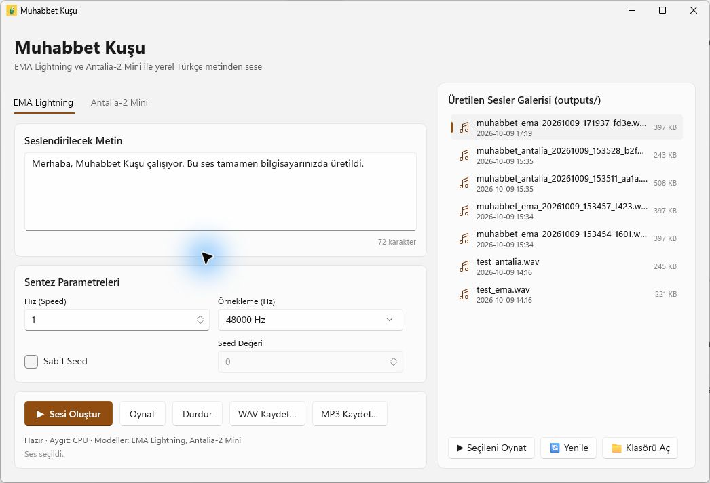
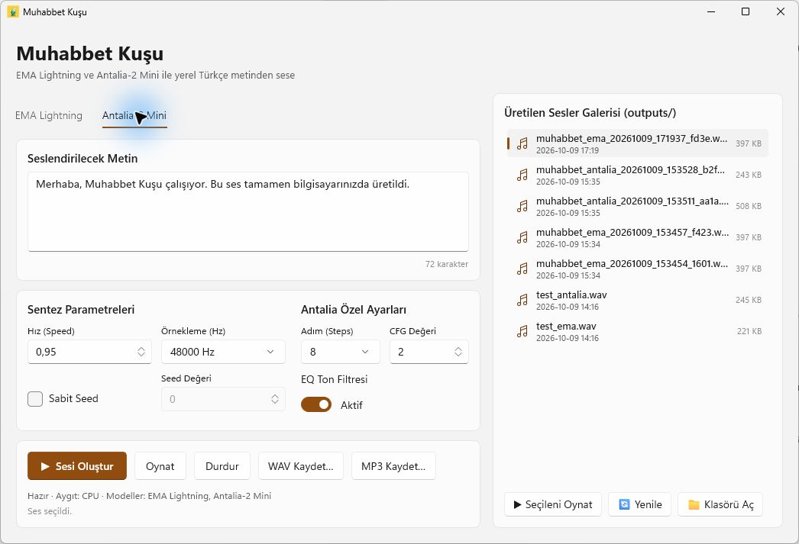

# Muhabbet Kuşu

Windows için yerel Türkçe metinden sese uygulaması. WinUI 3 arayüzü, **EMA Lightning** ve **Antalia-2 Mini** modellerini tek çalışma alanında sunar.

- Sekmelerden model seçimi ve Windows temasına uyumlu arayüz.
- Hız, örnekleme ve seed ayarları; Antalia için adım, CFG ve EQ kontrolleri.
- Üretim ilerlemesi, ses galerisi, oynatma ve WAV/MP3 dışa aktarma.

## Ekran Görüntüleri

**EMA Lightning**



**Antalia-2 Mini**



## Kurulum

Windows 10 (2004 ve sonrası) veya Windows 11, x64 gerekir. Setup dosyasını çalıştırın. Python, .NET ve FFmpeg kurulum paketine dahildir.

Modeller önce kurulum sırasında indirilir. Bu adım atlanırsa veya indirme tamamlanmazsa uygulama ilk açılışta yeniden dener. Modeller uygulama klasörünün `models/` dizininde saklanır. İndirme tamamlandıktan sonra internet gerekmez.

## Kaynaktan Çalıştırma

Geliştirme için .NET 8 SDK ve Python 3.12 gerekir.

```powershell
python -m pip install ema-lightning antalia-mini
.\build.ps1
.\run.ps1
```

Üretilen dosyalar `outputs/` klasörüne kaydedilir. Setup üretmek için Inno Setup 6.7+, FFmpeg ve kurulu Python paketleri ile `.\build-setup.ps1 -CompilerPath "C:\...\ISCC.exe"` çalıştırın. Çıktı `artifacts/setup/` klasöründedir.

## Lisans

Uygulama [MIT](LICENSE) lisansı ile sunulur. Modeller ve bağımlılıklar kendi lisanslarına tabidir.
